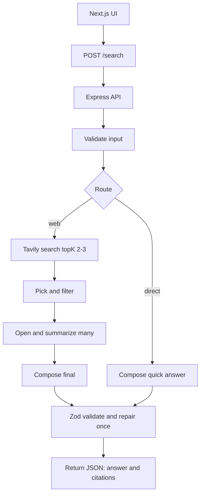

# Project Flow & Tavily Integration

Before we write any code, we need to map out the exact architecture of our AI Search Agent. This project introduces a complex, multi-step pipeline where the AI will decide whether to answer a question directly or browse the web for more information!

### The Architecture Flow

Below is the complete architectural flow of the agent we are going to build. 

### Explaining the Flow

1.  **The Request:** Just like in our previous project, the user interacts with a **Next.js UI**. When they hit submit, the client proxies the request to our **Express API** `POST /search` route, where we **Validate input**.
2.  **The Route Decision:** This is where the magic starts. We will use an LLM to act as a "Router". It analyzes the user's question and makes a critical decision: *Does this question require recent web data, or can I answer it directly?*
3.  **The Direct Path:** If the question is simple (e.g., "What is 2+2?"), the router bypasses the web entirely, saving time and money, and takes the path to **Compose quick answer**.
4.  **The Web Path:** If the question requires research:
    *   We trigger a tool called **Tavily search topK 2-3** to search the live web and grab the most relevant URLs.
    *   We **Pick and filter** those results.
    *   We pass the raw web content back into the LLM so it can **Open and summarize many**.
    *   Finally, the LLM will **Compose final** answer based *only* on the sources it just read.
5.  **Output Parsing:** Regardless of which path was taken, both routes merge back into our **Zod validate and repair once** step. The final output is forced into a strict JSON object to **Return JSON: answer and citations**!

### Introducing Tavily

In this project, we are introducing **Tavily**. 

Tavily is a search engine built specifically for AI agents. Unlike traditional search engines (like Google or Bing) which return HTML pages optimized for human eyeballs, Tavily returns clean, optimized JSON containing direct answers, snippets, and raw content that LLMs can instantly understand. 

By integrating Tavily as a "Tool" in our LangChain pipeline, we are giving our LLM the ability to actively browse the internet!
